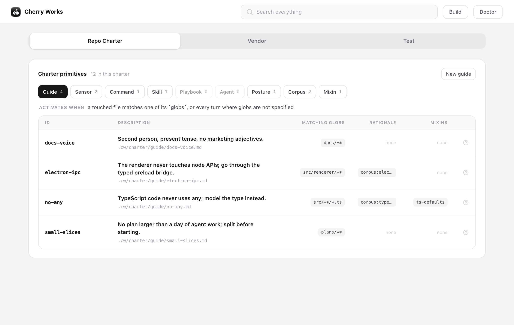
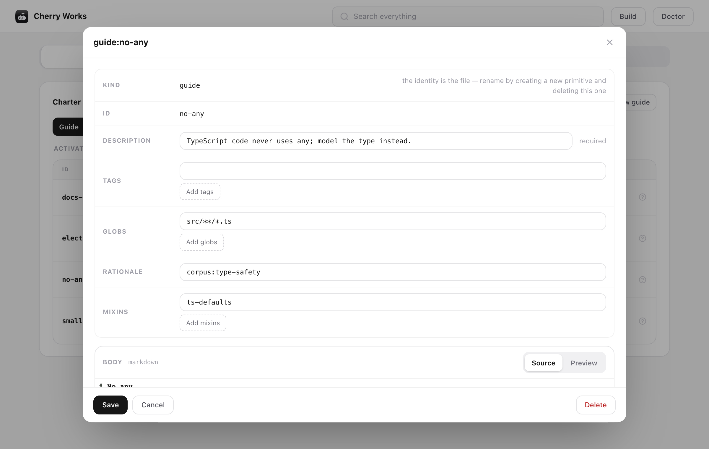
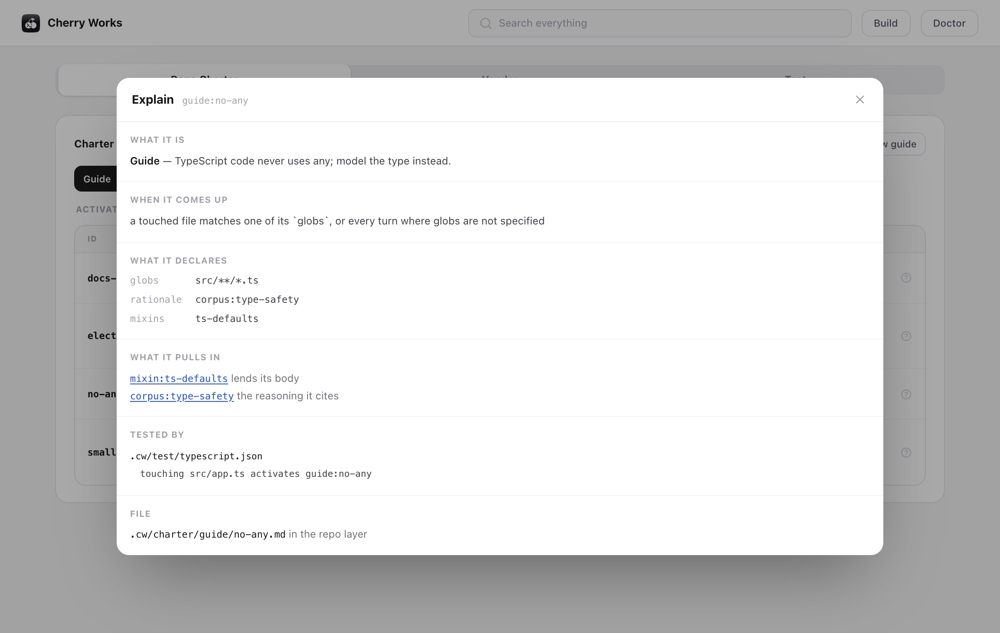
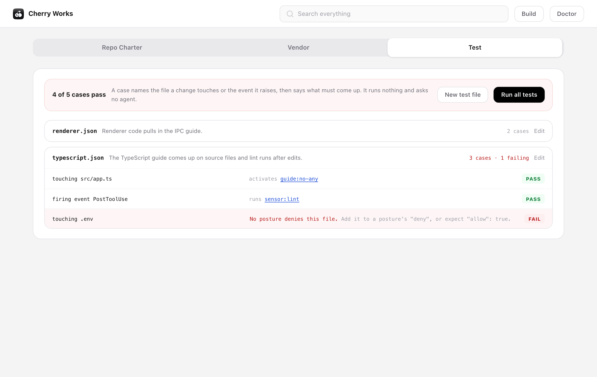

# Cherry Works

A charter engine for coding agents. You write your team's standards as small
markdown files, and `cw` checks them, tests them and compiles them into the
files your coding agent actually reads.

```text
.cw/charter/guide/no-any/index.md   ──cw build──▶   CLAUDE.md
.cw/charter/sensor/lint/index.md                    .claude/rules/…
.cw/charter/posture/secrets/index.md                .claude/settings.json (hooks, permissions)
…                                                   .claude/skills/…, .claude/agents/…
                                                    .mcp.json (cw mcp serve)
```

## Why

A coding agent follows whatever instructions it can see. Those instructions
usually end up as one long prompt file that nobody reviews and that falls out of
date. Cherry Works handles them the way you handle code:

- **Small, typed files.** Each rule is a separate primitive of one kind, such as
  a guide, a sensor or a posture. Each kind says which fields it requires and
  when it comes up.
- **One build.** `cw build` regenerates every file the agent reads from the
  charter in one pass. Nothing is edited by hand, and a rule you delete
  disappears from the output.
- **Checked and tested.** `cw doctor` names each broken file and says how to fix
  it. `cw test` runs cases that pin down which rule must come up for which file
  or event. It runs no command and needs no agent, so the result is the same on
  every machine.
- **Shared without copying.** You can install another team's charter as a vendor
  source. It is pinned to a version and committed with your code, and it never
  silently overrides your own rules.

## Requirements

- Node.js 22 or later
- git
- A supported agent. Today that is [Claude Code](https://claude.com/claude-code).
  `cw` always writes a neutral output under `.cw/out/` as well.

## Install

```bash
npm install -g cherry-works
cw --help
```

To run it once without installing anything, use `npx cherry-works <command>`.
To pin one version to a repository, so that its scripts and its CI run that
version whatever is installed globally, add it as a development dependency:

```bash
npm install -D cherry-works
npx cw --version
```

`cw --version` prints the version you are running. Upgrade with
`npm install -g cherry-works@latest`.

## Install from source

To run `cw` from a checkout of this repository, you also need pnpm 10 or later.
Build it and link it globally:

```bash
git clone https://github.com/tamnguyenvt/cherry-works.git
cd cherry-works
pnpm install
pnpm build
pnpm link --global
cw --help
```

The link points at your checkout. After you change the sources, run
`pnpm build` again. To remove the link, run `pnpm uninstall --global cherry-works`.

## Quick start

Inside the git repository you want to govern:

```bash
cw init                       # asks which agent to compile for (claude, selected), scaffolds .cw/charter/ and builds
cw kinds guide                # what a guide requires
cw add guide no-any --header description="No any in TypeScript." --header globs="src/**/*.ts"
cw edit guide:no-any          # write the body in $VISUAL or $EDITOR
cw build                      # compile the charter for your agent
cw doctor                     # check that everything holds
```

Commit `.cw/` together with what `cw build` wrote. Your agent now reads the rule
in every session in this repository.

## The charter

A primitive is a markdown file with YAML front matter. The folder it sits in
names its kind:

```markdown
---
kind: guide
id: no-single-word-naming
description: How to name a function or a variable.
globs: ["src/**/*.ts"]
---

Never name a function or variable with a single vague word such as `it`, `data`
or `merged`. Name it after what it holds or does.
```

Each kind comes up at a different time:

| Kind | Comes up when |
|---|---|
| `guide` | a touched file matches one of its `globs`, or on every turn when it has no globs |
| `sensor` | the `signal` it names is raised, and the harness runs its `run` command |
| `skill` | one of its `triggers` matches the request, or it is called by name as `/<id>` |
| `playbook` | one of its `triggers` matches; its body is a sequence of skills |
| `agent` | it is spawned by its id, with only the `tools` it lists |
| `posture` | always, wherever the host can be told what to `allow` and `deny` |
| `corpus` | a primitive's `rationale` cites it, to give the reasoning behind a rule |
| `mixin` | never on its own; its body is lent to the primitives that pull it in |
| `mcp` | a primitive's body names it as `[[<id>]]`: a place outside the repository, reached through `cw mcp serve` |

`cw kinds <kind>` gives the exact fields each kind takes. An id names exactly
one primitive across the whole charter, whatever its kind. If two files claim
the same id, the build is refused and both files are named. A primitive is
named by its id alone: bare in a header (`rationale: type-safety`), a test or a
command, and as `[[<id>]]` in a body, which the build turns into a link.
Every primitive is a folder holding its `index.md`, and any other file in that
folder is one of its assets, reached from the body as `./<file>`. An id is at
most 40 characters, and may be grouped with `/`: the mcp `mfbs/billing` is kept at
`.cw/charter/mcp/mfbs/billing/index.md`.

`cw build` compiles every primitive to `.cw/out/<kind>/<id>/index.md`, with its
assets copied beside it: its headers,
then the bodies of the mixins it pulls in, then its own. What your agent's host
is given points to that document, so you can open any primitive exactly as the
agent reads it.

## Commands

| Command | What it does |
|---|---|
| `cw init [--agent]` | Set the repository up under a charter, and build it |
| `cw build [--preview]` | Compile the charter, or show what a build would write |
| `cw list [--kind] [--min]` | List what the charter holds |
| `cw kinds [kind]` | List the kinds, or the fields one of them requires |
| `cw add <kind> <id> [--header k=v …]` | Write a new primitive |
| `cw edit <id>` | Open a primitive's file in your editor |
| `cw remove <id> [--yes]` | Delete a primitive this repository authored |
| `cw explain <id>` | Show which file declares an id, what it pulls in and which tests name it |
| `cw doctor` | Check the agents, the charter, the vendor sources and the compiled output |
| `cw test` | Run every case in `.cw/test/` against the charter |
| `cw suite add \| edit \| remove` | Manage test files |
| `cw vendor add <source> [--ref] \| remove \| list` | Install, update, remove or list vendor sources |
| `cw portal [--port]` | Open the charter in a browser on this machine |
| `cw mcp auth [id] [--status]` | Sign in, as yourself, to every place the charter reaches, or to one again |
| `cw mcp serve` | Serve every place the charter reaches to your agent, over stdio |

`cw doctor` exits with a failure status when the charter has an error, when a
vendored file was edited in this repository, or when the compiled output no
longer matches the charter. That makes it a gate you can run in CI.

## The portal

If you would rather not remember commands and field names, run the portal from
inside a governed repository:

```bash
cw portal               # serves on port 9927, or the next free port
cw portal --port 8080
```

It prints an address such as `http://127.0.0.1:9927/?t=…`. Open that address in
your browser. The page has three tabs:



- **Repo Charter** lists every primitive of this repository by kind, with the
  engine's own line on when that kind comes up. From here you can create a
  primitive, then open it to edit its fields and its markdown body, or delete
  it. The form is built from what the kind requires, so it asks only for the
  fields that kind takes. The **?** on a row explains the primitive: when it
  comes up, what it pulls in, what cites it and which tests name it.

  | Editing a primitive | Explaining it |
  |---|---|
  |  |  |
- **Vendor** lists the vendor sources you installed and their primitives, which
  are read-only. You can add a source by its git address and a version, or
  remove one.
- **Test** lists the test files in `.cw/test/`. You can create, edit and delete
  them, and run every case to see which pass and why a failing one failed.

  

The header has a search that finds any primitive in any layer, and two buttons:
**Build**, which shows what a build would write before it writes anything, and
**Doctor**, which runs the health check and offers a build when the output is
behind.

The portal drives the same engine as the command line and adds no behaviour of
its own. What it shows is what the engine answered, and everything it does has
a command-line equivalent. When the engine refuses a change, the portal shows
the refusal in the engine's words and writes nothing. It listens only on
`127.0.0.1`, and every request needs the token in the printed address. Stop it
with Ctrl+C.

## Testing a charter

A test file in `.cw/test/` describes situations and what must come up in each
one:

```json
{
  "description": "The TypeScript guide comes up on source files.",
  "cases": [
    { "do": { "touchFile": "src/one.ts" }, "expect": { "activate": "guide:no-any" } },
    { "when": "Stop", "expect": { "run": "sensor:lint" } },
    { "do": { "touchFile": ".env" }, "expect": { "allow": false } }
  ]
}
```

`cw test` resolves each case against the charter and reports the ones that no
longer hold.

## Vendor sources

```bash
cw vendor add git@github.com:your-org/charter-baseline.git --ref v1.2.0
```

A vendor source is a git repository set up with `cw init`: author its charter
there, test it, and push. Only its `.cw/charter/` folder is installed, under
`.cw/vendor/<name>/`, pinned to the ref you chose and committed. A repository
without that folder is refused, and so is one that has vendors of its own:
vendoring is one level deep. Vendored primitives are read-only. To differ from
one, write your own primitive under a new id.

Run `cw vendor add` again with a new `--ref` to update a source, and
`cw vendor remove <name>` to take it away. Run `cw build` after either.

### Recommended charter vendors

| Charter | What it gives your agent | Install |
| --- | --- | --- |
| [hexagonal-architecture-charter](https://github.com/tamnguyenvt/hexagonal-architecture-charter) | Sets up a hexagonal (ports and adapters) architecture in a folder you choose, then keeps the agent following it. | `cw vendor add git@github.com:tamnguyenvt/hexagonal-architecture-charter.git --ref v0.1.0` |

## Places outside the repository

Much of what an agent needs to know is kept elsewhere: another service's code,
an issue tracker, a wiki. An `mcp` primitive declares one such place, an MCP
server, and the tools of it your agent may use:

```markdown
---
kind: mcp
id: mfbs/billing
description: Billing service code and pull requests.
endpoint: https://api.githubcopilot.com/mcp/
path: moneyforward/billing-service
auth: ["oauth", "token"]
tools: ["get_file_contents", "search_code", "list_pull_requests"]
---

The billing service. Look here before changing anything that charges a customer.
```

A place is either an `endpoint` reached over HTTP, or a `command` with its
`args` that `cw` starts as a local process; a local one takes a token only, in
the environment variable its `tokenEnv` names. Any primitive points the agent
at a place by naming it in its body as `[[mfbs/billing]]`.

```bash
cw build            # adds one entry, cw mcp serve, to your agent's .mcp.json
cw mcp auth         # sign in to every place you are not signed in to yet
cw mcp auth --status
```

Every developer signs in as themselves, by browser where the place offers OAuth
or with a token typed at a hidden prompt. Credentials are kept in the operating
system's credential store, never in the repository, and renewed without asking
where the place allows it. `cw mcp serve` is the one MCP server your agent is
given: it serves the tools each place declares and forwards every call under
your own credential. A place that is down or not signed in to loses only its own
tools.

A subagent reaches only the places it lists under `tools`: `[[<id>]]` for every
tool of a place, or `[[<id>]]:<tool>` for one of them.

## Your agent can write rules too

Every governed repository gets a built-in skill, `skill:cw-author`, in the
agent's hands from the moment `cw init` finishes. It teaches
the agent to ask `cw kinds` what a kind requires and to write primitives with
`cw add`, instead of copying fields from memory.

## Development

```bash
pnpm install
pnpm exec playwright install chromium   # once per machine, for the portal's browser tests
pnpm test                               # dependency rules, build, then every test
pnpm typecheck
pnpm cw <command>                       # run the CLI from source, without building
```

A release is `pnpm release <version>`, run from a clean `develop` level with
`origin/develop`. It runs the tests, installs the exact package it would publish
into a fresh repository and builds it there, and only then commits, tags
`v<version>`, publishes and pushes. `pnpm release <version> --dry-run` runs
every check and changes nothing. A plain `npm publish` is refused.

The engine follows a hexagonal layout. `src/hexagon/` holds the domain, the
application use cases and their ports. `src/driver/` holds the CLI and the
portal that drive it. `src/zdriven/` holds the adapters for files, git and YAML.
What it must do is written in [specs/spec.md](specs/spec.md).

This repository is governed by its own charter under [.cw/charter/](.cw/charter/).
