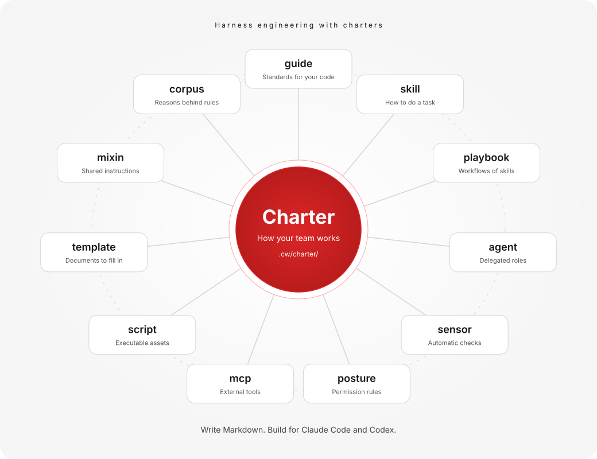
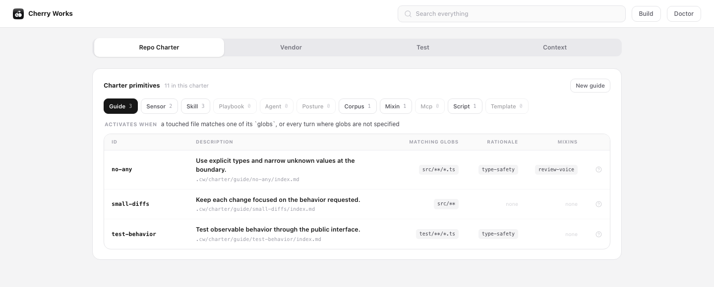

# Cherry Works

Current version: **0.9.0**

**Your team's way of working, written once for coding agents.**

Keep coding standards, workflows, tools and permissions in a **charter**:
small Markdown files you can review, test and share. Cherry Works compiles
them into the files **Claude Code** and **Codex** read.



## Why use it?

- **Keep instructions maintainable.** One rule or workflow per file, with an
  explicit purpose and scope.
- **Build for your agent.** Generate instructions, skills and supported host
  settings from the same source.
- **Check what you ship.** Validate the charter, test which rules apply, and
  evaluate whether a real agent follows them.
- **Share your team's practices.** Publish a vendor charter and install a
  versioned copy in other repositories.

## Get started

You need **Node.js 22+**, **Git**, and Claude Code or Codex.

```bash
npm install -g cherry-works
```

Using a local checkout? [Build and link it globally with pnpm](docs/reference.md#install-from-a-local-checkout).

Inside the repository you want to govern:

```bash
cw init                    # choose your agent and initialize the charter
cw add guide no-any --header description="No any in TypeScript." --header globs="src/**/*.ts"
cw edit no-any             # write the rule in your editor
cw build                   # generate the agent's files
cw doctor                  # check the result
```

Your rule lives at `.cw/charter/guide/no-any/index.md`. Edit that source and
rebuild when it changes. Review and commit `.cw/` together with the generated
agent files.

→ [Write your first charter](docs/writing-a-charter.md)

## What's in a charter?

Each building block is a **primitive**: an `index.md` with YAML headers and
instructions, plus any supporting files.

| Purpose | Primitives |
|---|---|
| Set standards and permissions | `guide`, `posture` |
| Describe tasks, workflows and delegated roles | `skill`, `playbook`, `agent` |
| Run checks and connect tools | `sensor`, `script`, `mcp` |
| Reuse instructions, documents and reasoning | `mixin`, `template`, `corpus` |

Run `cw kinds` to explore them, or `cw kinds guide` for one kind's fields.
Each id is unique across your charter, installed vendors and built-ins.

## Reuse a team's charter

Install a published charter, then build it for your agent:

```bash
cw vendor add your-org/charter-baseline --ref v1.0.0
cw build
```

A vendor copy is read-only and updated from its source. To copy the content
into your own editable charter instead, use `cw vendor inject`.

→ [Create and publish a vendor source](docs/creating-a-vendor.md)

### Recommended charter vendors

| Charter | What it gives your agent | Install |
| --- | --- | --- |
| [sdd-charter](https://github.com/tamnguyenvt/sdd-charter) | Spec-driven development: a spec set with a status per story and a roadmap of their dependencies, and six commands (`/sdd-init`, `/sdd-plan`, `/sdd-implement`, `/sdd-bug-fix`, `/sdd-status`, `/sdd-report`) that take each story from request to merge, stopping for your yes at each step. | `cw vendor add git@github.com:tamnguyenvt/sdd-charter.git --ref v0.1.7` |

## Work from the terminal or browser

```bash
cw portal                  # browse and edit the charter locally
cw test                    # test activation and permission rules, without an agent
cw context                 # estimate the charter's context size
cw eval --agent codex       # evaluate with the real agent; spends tokens
```



## Documentation

- [Writing a charter](docs/writing-a-charter.md) — rules, workflows, references
  and tests.
- [Creating a vendor source](docs/creating-a-vendor.md) — publish, install and
  update a shared charter.
- [Using the portal](docs/use-portal.md) — edit, test and build in your browser.
- [Reference](docs/reference.md) — commands, host mappings, evaluations,
  context costs, vendor sources and MCP configuration.
- [Development](docs/reference.md#development) — build from source, run checks
  and release.
- [Changelog](CHANGELOG.md) — releases and changes.

This repository uses [its own charter](.cw/charter/) and keeps its product
specifications in [specs/](specs/spec.md).
